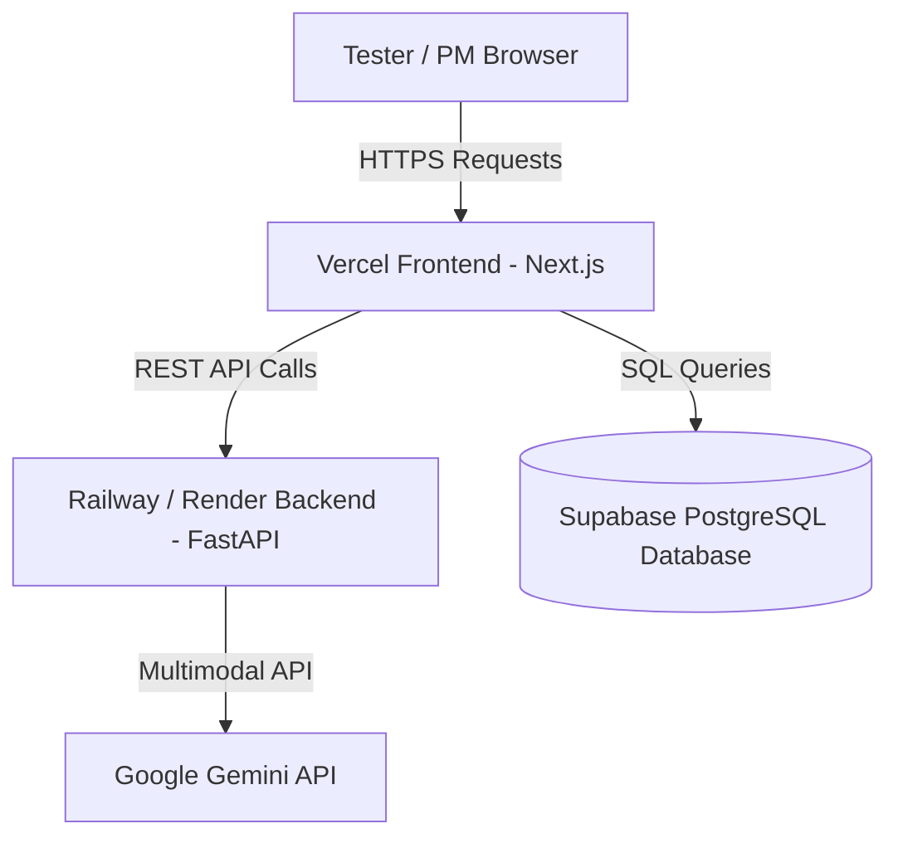

# 🌐 UAT QA Tool — Live Production Deployment Guide

Hướng dẫn triển khai dự án UAT QA Tool lên môi trường Live Production (Vercel + Railway/Render + Supabase).

---

## 🎯 Tổng Quan Kiến Trúc Live Production

---

## 1. 🐍 Deploy Backend FastAPI lên Railway / Render

FastAPI xử lý các tác vụ LLM nặng (sinh test case từ PDF, Gemini Vision judge bằng chứng). Cần nền tảng hỗ trợ **long-running Python process** (Railway hoặc Render Web Service).

### Cách Deploy qua Render (Miễn phí & Tự Động):
1. Đăng nhập [Render.com](https://render.com).
2. Nhấn **New +** -> Chọn **Web Service**.
3. Kết nối với Repository GitHub chứa thư mục `uat-qa-tool`.
4. Cấu hình các thông số:
   - **Root Directory**: `backend`
   - **Runtime**: `Python 3`
   - **Build Command**: `pip install -r requirements.txt`
   - **Start Command**: `python -m uvicorn main:app --host 0.0.0.0 --port $PORT`
5. Thêm Biến Môi Trường (Environment Variable):
   - `GEMINI_API_KEY`: `<Khóa Gemini API của bạn>`
6. Nhấn **Create Web Service**. Sau khi build xong, bạn sẽ nhận được URL Backend dạng:  
   👉 `https://uat-qa-tool-backend.onrender.com`

---

## 2. ⚡ Deploy Frontend Next.js lên Vercel

### Cách Deploy qua Vercel:
1. Đăng nhập [Vercel.com](https://vercel.com).
2. Nhấn **Add New...** -> **Project**.
3. Import Repository chứa dự án `uat-qa-tool`.
4. Cấu hình project:
   - **Framework Preset**: `Next.js`
   - **Root Directory**: `frontend`
5. Thêm các Biến Môi Trường (Environment Variables):
   - `FASTAPI_URL`: `https://uat-qa-tool-backend.onrender.com` *(URL backend ở Bước 1)*
   - `NEXT_PUBLIC_SUPABASE_URL`: `https://<your-project-ref>.supabase.co`
   - `NEXT_PUBLIC_SUPABASE_ANON_KEY`: `<your-supabase-anon-key>`
   - `SUPABASE_SERVICE_ROLE_KEY`: `<your-supabase-service-role-key>`
6. Nhấn **Deploy**. Bạn sẽ nhận được URL Live Frontend dạng:  
   👉 `https://uat-qa-tool.vercel.app`

---

## 3. 🗄️ Cấu Hình Database Supabase Thật

1. Vào [Supabase.com](https://supabase.com) -> Mở project của bạn.
2. Vào **SQL Editor** -> Dán toàn bộ file [`database/schema.sql`](file:///C:/Users/huutan.trinh/uat-qa-tool/database/schema.sql) và bấm **Run**.
3. Sau khi người dùng hoặc tester upload PRD trên Vercel Frontend, toàn bộ dữ liệu sẽ xuất hiện trực tiếp trong **Supabase Table Editor** tại 3 bảng: `prds`, `test_cases`, và `test_results`!
